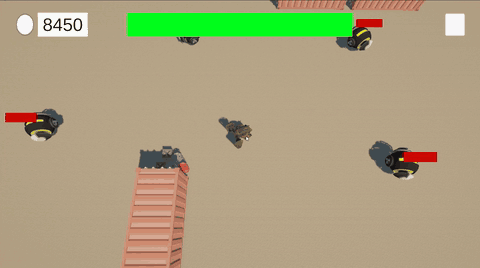
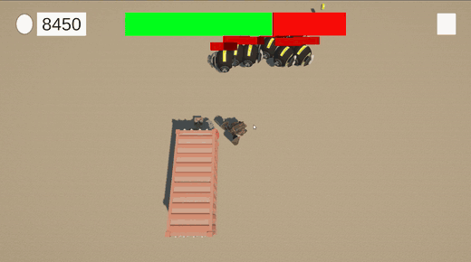
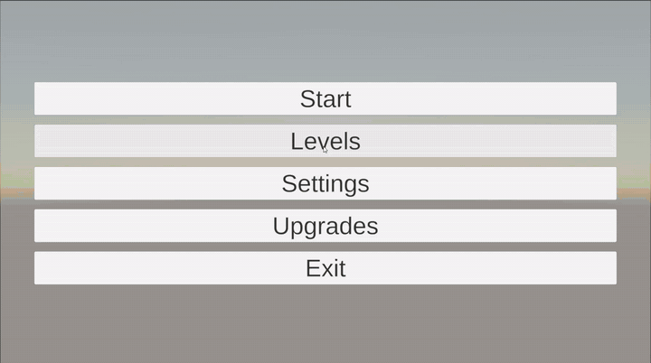
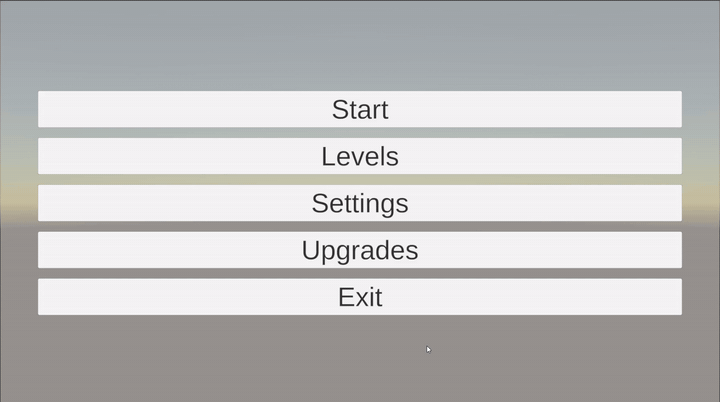
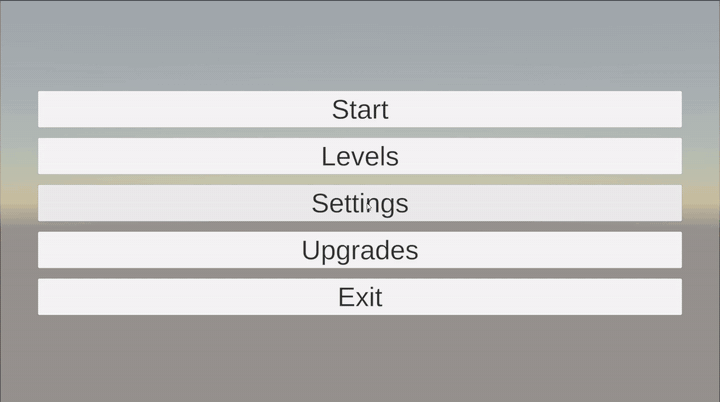

# Drone Attack

Аркадный top-down шутер на Unity: игрок управляет боевым дроном и отбивается от волн врагов, которые наступают со всех сторон. За победы начисляются монеты, на них покупаются улучшения, а с прохождением уровней открывается новое оружие.

Проект разрабатывался в 2024–2025 годах.

<p align="center">
  
</p>

## Демо

<p align="center">
  
  <br>
  <em>Бой, победа на уровне, награда и выпавшие монеты и аптечки</em>
</p>

<table>
  <tr>
    <td align="center"><br><em>Выбор уровня</em></td>
    <td align="center"><br><em>Покупка улучшений</em></td>
    <td align="center"><br><em>Настройки</em></td>
  </tr>
</table>

## Что есть в игре

- **8 уровней.** Число врагов растёт от 4 до 16, на некоторых уровнях действует таймер: не успел перебить всех — уровень проигран.
- **4 вида оружия**, которые открываются по мере прохождения:

  | Оружие | Особенность | Открывается |
  |---|---|---|
  | SMG | 10 выстрелов в секунду, слабая отдача | сразу |
  | Rifle | 5 выстрелов в секунду | после 1-го уровня |
  | Shotgun | веер из 6 дробин с разбросом | после 2-го уровня |
  | Rocket Launcher | ракета с уроном по площади и взрывной волной | после 4-го уровня |

- **Отдача.** У каждого оружия своя сила отдачи, которая толкает дрон назад при выстреле.
- **Способность Bullet Time.** За 10 монет замедляет врагов и снаряды на 70% на 3 секунды.
- **Дроп с врагов.** Монеты или аптечки.
- **Улучшения за монеты.** Урон, отдача и здоровье, по 10 уровней каждое.
- **Сохранение прогресса** и настройка звука.
- **Две схемы управления.** Клавиатура с мышью на ПК и экранный джойстик на Android.

## Управление (ПК)

| Действие | Клавиша |
|---|---|
| Движение | WASD / стрелки |
| Прицеливание | мышь |
| Стрельба | ЛКМ / Left Ctrl |
| Смена оружия | F |
| Bullet Time | E |

## Как устроен проект

**Архитектура на DI.** Все сервисы и фабрики регистрируются в Zenject-инсталлерах (`ProjectInstaller`, `InfrastructureInstaller`, `StateMachineInstaller`, а также инсталлеры сцен), а зависимости внедряются в компоненты через `[Inject]`.

**Стейт-машина игры.** `GameStateMachine` переключает состояния `Bootstrap → StartScene → GameLoop`: загружает нужную сцену и показывает экран загрузки.

**Конфиги на ScriptableObject.** Параметры игрока, врагов, оружия, снарядов, уровней и способностей вынесены в ассеты в `Configs/`. Баланс настраивается без правки кода.

**Пулы объектов.** `ActorsFactory` и `WeaponsFactory` заранее создают врагов и снаряды асинхронно, не блокируя кадр, а после использования возвращают их в пул вместо уничтожения.

**Реактивность.** Спавн волн, таймер уровня и длительность Bullet Time сделаны на R3 (`Observable.Interval`, `Observable.Timer`).

**Обобщённое оружие.** `WeaponController<TConfig>` и `ProjectileController<TConfig>` содержат общую логику стрельбы и попаданий, а конкретное оружие только переопределяет нужное: дробовик выпускает веер снарядов, ракета взрывается по площади.

**Сервисы.**
- `PlayerProgressService` — монеты, улучшения, открытые уровни.
- `LevelProgressWatcher` — ход уровня, победа и поражение.
- `EnemySpawnerService` — спавн врагов по кругу вокруг игрока.
- `AbilitiesService` — способности.
- `PauseService` — пауза.
- `SettingsService` — настройки.
- `IInputService` — ввод, с отдельными реализациями для ПК и мобильных устройств.

**ИИ врагов.** Враги преследуют игрока через `NavMeshAgent` и атакуют в ближнем радиусе с перезарядкой.

### Структура

```
Assets/_Drone Attack/
├── Configs/          ScriptableObject-конфиги и их ассеты
├── Gameplay/         Игрок, враги, оружие и снаряды, дроп
├── Infrastructure/   Инсталлеры, стейт-машина, сервисы, фабрики
├── UI/               Меню, выбор уровня, улучшения, HUD, окна
├── Environment/      Модели и материалы окружения
└── Scenes/           Start, GameLoop
```

## Технологии

- Unity 6 (6000.5), URP
- Zenject (Extenject) — внедрение зависимостей
- R3 — реактивное программирование
- AI Navigation (NavMesh) — передвижение врагов
- DOTween — анимации UI
- TextMeshPro — текст в интерфейсе
- SimpleInput — мобильное управление

## Запуск

1. Клонировать репозиторий.
2. Открыть проект в Unity 6000.5 или новее.
3. Открыть сцену `Assets/_Drone Attack/Scenes/Start.unity` и нажать Play.

## Лицензия

[MIT](LICENSE)
